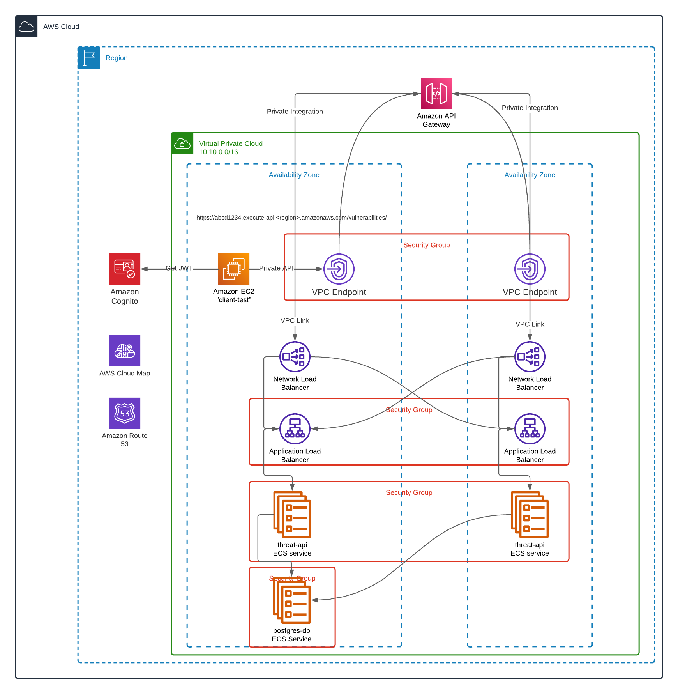
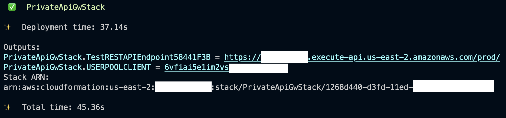

# Overview



This CDK application builds the following:

* A Cognito user pool and application client
* A VPC with 2 public and 2 private subnets and 1 NAT gateway
* An ECS service that stands up the threat API
* An ECS service that stands up a PostgreSQL database
* AWS Cloud Map namespace for service discovery using DNS A records for the ECS tasks
* An Application Load Balancer to distribute traffic to the API ECS service
* A private REST API Gateway API with VPC endpoints in the VPC
* A Network Load Balancer to support VPC link / private integration for API Gateway
* A Cognito authorizer associated to this resource
* An EC2 instance called `client-test` which can be used for testing the API endpoints

## Deployment

Install the python dependencies first. Dependencies are stored in the [Pipfile](Pipfile) and can be installed using [Pipenv](https://pipenv.pypa.io/en/latest/).

```bash
# create the environment
pipenv --python 3.9
# install dependencies
pipenv install
# activate the environment
pipenv shell
```

Using the [AWS CDK](https://aws.amazon.com/cdk/), deploy the application.

```bash
cdk deploy
```

Once complete, save the values from the output to a text editor for future use.



## Create a user

Before you can test the API Gateway endpoint, you first need to create a user in the Cognito user pool.

The next series of commands are best run from [AWS CloudShell](https://aws.amazon.com/cloudshell/) in the same region you are working. Using the [aws cli](https://docs.aws.amazon.com/cli/latest/userguide/cli-chap-welcome.html), run the following, being sure to replace `user@example.com` and the password with values specific to your environment:

```bash
# Export values saved to your text editor from previous step
export USERPOOLCLIENT=youruserpoolclientid
# Creates a user in the Cognito User Pool
aws cognito-idp sign-up --client-id $USERPOOLCLIENT  --username user@example.com --password 'ThisIsMyTemp0rary#' --user-attributes Name="email",Value="user@example.com"
```

Once you have created the user, you need to confirm the user in the user pool so that they may log in. See [step 3 here](https://docs.aws.amazon.com/cognito/latest/developerguide/signing-up-users-in-your-app.html#signing-up-users-in-your-app-and-confirming-them-as-admin).

## Generate a token

```bash
aws cognito-idp initiate-auth --auth-flow USER_PASSWORD_AUTH --auth-parameters USERNAME='user@example.com',PASSWORD='ThisIsMyTemp0rary#' --client-id $USERPOOCLIENT
```

Copy the value of `IdToken` that is returned for later use.

## Test the API

Log on to the EC2 instance that is deployed into the VPC. You can use [AWS Systems Manager Session Manager](https://docs.aws.amazon.com/systems-manager/latest/userguide/session-manager.html) to [connect to the instance](https://docs.aws.amazon.com/systems-manager/latest/userguide/session-manager-working-with-sessions-start.html#start-ec2-console).

To simplify the command, export the following into your environment:

```bash
# From the output tab of the CloudFormation console
export APIENDPOINT=yourAPIendpointURL
# The ID token generated from the cognito command earlier
export IDTOKEN=longstringofcharacters
```

Now test the API Gateway endpoint using curl:

```bash
curl -X GET ${APIENDPOINT}vulnerabilities/ -H "Authorization: $IDTOKEN"
```

You should get a JSON response similar to:

```JSON
[]
```